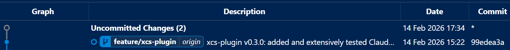
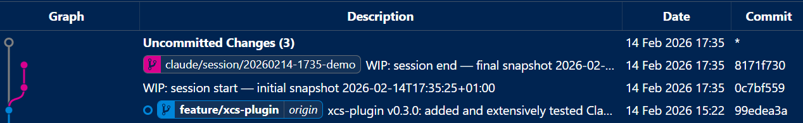
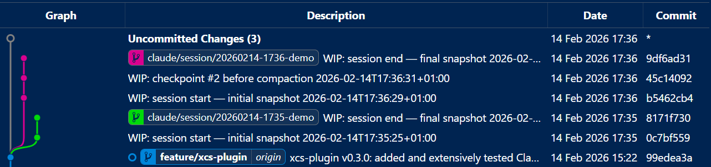
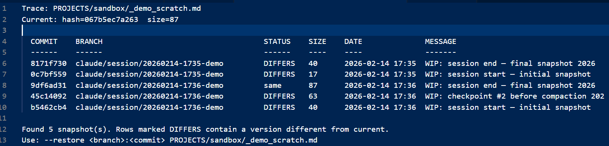
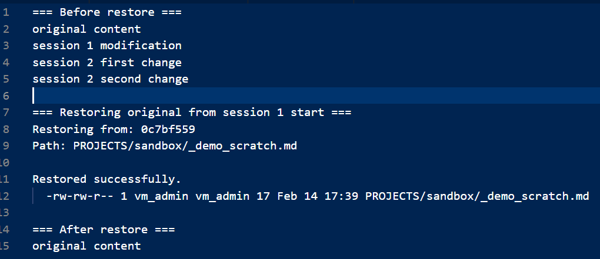

# claude-code-hooks

> **Give a solid memory to your Claude Code Engineering team.**<br>
> **Never lose work, never lose context again.**
>
> Claude Code sessions are ephemeral — when they end, your working tree changes, session context, and plan files scatter or vanish. These hooks fix that: every session is automatically versioned on a local git branch, session logs persist so Claude picks up where it left off, and plan files get human-readable names instead of `bubbly-imagining-stearns.md`. Claude can call the rollback helper (`claude-session-rollback.sh`) directly to trace, compare, and restore any file to any checkpoint — no manual intervention needed.

Productivity hooks for [Claude Code](https://docs.anthropic.com/en/docs/claude-code) that add **git session safety net**, **session memory**, **automatic plan file renaming**, **git safety checks**, and **plugin cache sync**.

**Why useful?** Each hook solves a real annoyance:

- **Git session safety net** — every session automatically snapshots your working tree onto a parallel branch; Claude can use the rollback helper to trace and restore any file to any checkpoint, across sessions, autonomously
- **Session memory** — pick up where you left off; sessions leave a searchable paper trail instead of vanishing
- **Plan rename** — Claude's random three-word plan filenames (`bubbly-imagining-stearns.md`) become dated, human-readable names (`20260211-1620-add-user-auth.md`)
- **Git safety** — preflight checks for SSH connectivity, GPG signing, and accidental secret commits before every `git commit`
- **Plugin cache sync** — edit plugin source files and have the frozen cache update automatically, no IDE reload needed

## What Are Claude Code Hooks?

Claude Code supports [hooks](https://docs.anthropic.com/en/docs/claude-code/hooks) — custom scripts that run automatically at specific lifecycle events (session start, session end, before compaction, before tool use). Hooks let you extend Claude Code's behavior without modifying the tool itself.

## Hooks Included

### Git Session Safety Net (`hooks/git-session/`)

Automatic working tree snapshots on parallel git branches — without ever switching your checked-out branch.

| Hook                          | Event        | What It Does |
|-------------------------------|--------------|-------------|
| `git-session-start.sh`        | SessionStart | Creates a session branch (`claude/session/YYYYMMDD-HHMM-XXXX`) from HEAD and takes an initial snapshot |
| `git-session-checkpoint.sh`   | PreCompact   | Snapshots the working tree before context compaction |
| `git-session-end.sh`          | Stop         | Takes a final snapshot and prints a summary with the branch name |
| `claude-session-rollback.sh`  | (helper)     | CLI tool for listing, tracing, and restoring files from session snapshots |

**How it works:**
1. On session start, a new branch is created from `HEAD` using `git branch` (no checkout)
2. Working tree snapshots are committed to the session branch using git plumbing (`write-tree` + `commit-tree` + `update-ref`) — your checked-out branch is never touched
3. Each snapshot tries GPG signing first, falls back to unsigned if unavailable
4. On session end, a summary is printed: branch name, checkpoint count, rollback instructions
5. Sessions are fully independent — concurrent sessions each get their own branch

#### In action

**Before any session** — a clean Git Graph with just your working branch:



**After session 1** — the first `claude/session/*` branch forks off HEAD with 2 snapshots (start + end):



**After session 2** — a second session branch appears with 3 snapshots (start + checkpoint + end):



**Trace a file** — `--trace` finds every version across all sessions in one pass:



**Restore any version** — pick a commit from the trace and restore instantly:



**Rollback helper** (`claude-session-rollback.sh`):
```bash
claude-session-rollback.sh --list                          # List all session branches
claude-session-rollback.sh --trace <path>                  # Find all versions of a file across sessions
claude-session-rollback.sh --restore <branch>:<commit> <path>  # Restore a specific version
claude-session-rollback.sh --show <branch>                 # Show checkpoint log
claude-session-rollback.sh --diff <branch>                 # Show files changed
claude-session-rollback.sh --cleanup [days]                # List stale branches
```

**Example — tracing a corrupted file:**
```
$ claude-session-rollback.sh --trace src/config.js
Trace: src/config.js
Current: hash=a1b2c3d4e5f6  size=87

  COMMIT    BRANCH                                    STATUS    SIZE    DATE              MESSAGE
  ------    ------                                    ------    ----    ----              -------
  8172f51a  claude/session/20260214-1339-9061         DIFFERS   2048    2026-02-14 13:41  WIP: session end — final snapshot
  aa8b23da  claude/session/20260214-1339-9061         same      87      2026-02-14 13:40  WIP: session start — initial snapshot

Found 2 snapshot(s). Rows marked DIFFERS contain a version different from current.
Use: --restore claude/session/20260214-1339-9061:8172f51a src/config.js
```

**Why?** Claude Code sessions can modify files in ways that are hard to undo — especially across long sessions with context compaction. This hook gives you automatic, zero-effort versioning. When something goes wrong, just ask Claude: it will run `~/.claude/hooks/claude-code-hooks/git-session/claude-session-rollback.sh` to trace all versions and restore the right one — no manual git commands needed.

> **Note:** Requires a git repository. Non-git projects are silently skipped (exit 0).

### Session Memory (`hooks/memory/`)

Track session context across Claude Code sessions.

| Hook                          | Event        | What It Does |
|-------------------------------|--------------|-------------|
| `session-start.sh`            | SessionStart | Scans for recent session files and learned skills, reports availability to stderr |
| `session-end.sh`              | Stop         | Creates/updates a dated session log (`~/.claude/sessions/YYYY-MM-DD-XXXXXXXX-session.md`) with timestamps and tracking sections |
| `pre-compact.sh`              | PreCompact   | Logs compaction events and annotates the active session file before Claude summarizes context |

**Why?** Claude Code sessions are ephemeral. These hooks create a paper trail so you (and Claude) can pick up where you left off.

### Plan Auto-Rename (`hooks/plan-rename/`)

Automatically rename Claude's randomly-generated plan files to descriptive, dated names.

| Hook                          | Event             | What It Does |
|-------------------------------|-------------------|-------------|
| `rename-plan.js`              | Stop + SessionStart | Detects random plan names (e.g., `bubbly-imagining-stearns.md`) and renames them based on content (e.g., `20260211-1620-add-user-auth.md`) |

Title extraction priority:
1. Frontmatter `title:` field
2. First `# H1` heading
3. First line of `## Overview` section (if >= 20 chars)
4. First meaningful line >= 20 chars

**Why?** Claude Code generates random three-word plan filenames that are impossible to find later. This hook makes plan files searchable and dated.

> **Note:** The rename hook runs on both Stop and SessionStart because the Stop hook can be unreliable when Claude is in plan mode. Running at SessionStart catches any plans missed during the previous session's shutdown.

### Plugin Cache Sync (`hooks/plugin-sync/`)

Auto-sync Claude Code plugin source directories to the frozen plugin cache.

| Hook                          | Event        | What It Does |
|-------------------------------|--------------|-------------|
| `plugin-cache-sync.sh`        | SessionStart | Discovers plugin source directories (via `.claude-plugin/plugin.json`), compares against a `.last-sync` marker, and runs `rsync` when changes are detected |

How it works:
1. Scans `~/.claude/` (or custom `PLUGIN_ROOTS`) for directories containing `.claude-plugin/plugin.json`
2. Derives the cache path from plugin name/version: `~/.claude/plugins/cache/<org>/<name>/<version>/`
3. Syncs only when source files are newer than the `.last-sync` marker (no-op when up to date)
4. Skips self-sync (when source and cache resolve to the same path)

**Why?** Claude Code's native plugin system uses a frozen cache. When you edit plugin source files during development, the cache doesn't update automatically. This hook bridges that gap on every session start.

> **Note:** Only useful if you develop Claude Code native plugins. If you only use the BMAD-like pattern or don't use plugins, skip this hook.

### Git Safety (`hooks/cicd/`)

Pre-commit validation for SSH, GPG signing, and sensitive file detection.

| Hook                          | Event      | What It Does |
|-------------------------------|------------|-------------|
| `pre-commit-guard.sh`         | PreToolUse | Validates SSH connectivity, GPG signing config, and scans for sensitive staged files before `git commit` |

Three validation stages:
1. **SSH connectivity** (BLOCKING) — tests `ssh -T git@github.com`; blocks commit on failure
2. **GPG signing** (warnings) — checks `commit.gpgsign`, `tag.gpgsign`, signing key configured
3. **Sensitive files** (warnings) — scans staged files for `.env`, private keys, credentials, API keys

**Why?** Prevents commits over HTTPS (when SSH should be used), unsigned commits, and accidental secret exposure.

## Quick Start

### Option A: Install Script

```bash
git clone https://github.com/HornetGit/claude-code-hooks.git
cd claude-code-hooks
bash install.sh
```

Then add the hook configuration to `~/.claude/settings.json` (the script prints the snippet).

### Option B: Manual Setup

1. Copy hooks to your preferred location:
```bash
mkdir -p ~/.claude/hooks/claude-code-hooks
cp -r hooks/* ~/.claude/hooks/claude-code-hooks/
```

2. Add to `~/.claude/settings.json` (merge with existing config — see `examples/settings.json` for the full version):
```json
{
  "hooks": {
    "Stop": [
      {
        "matcher": "*",
        "hooks": [
          { "type": "command", "command": "~/.claude/hooks/claude-code-hooks/git-session/git-session-end.sh", "timeout": 10 },
          { "type": "command", "command": "~/.claude/hooks/claude-code-hooks/memory/session-end.sh" },
          { "type": "command", "command": "node ~/.claude/hooks/claude-code-hooks/plan-rename/rename-plan.js", "timeout": 10 }
        ]
      }
    ],
    "SessionStart": [
      {
        "matcher": "*",
        "hooks": [
          { "type": "command", "command": "~/.claude/hooks/claude-code-hooks/git-session/git-session-start.sh", "timeout": 10 },
          { "type": "command", "command": "~/.claude/hooks/claude-code-hooks/memory/session-start.sh" },
          { "type": "command", "command": "node ~/.claude/hooks/claude-code-hooks/plan-rename/rename-plan.js", "timeout": 10 },
          { "type": "command", "command": "~/.claude/hooks/claude-code-hooks/plugin-sync/plugin-cache-sync.sh", "timeout": 15 }
        ]
      }
    ],
    "PreCompact": [
      {
        "matcher": "*",
        "hooks": [
          { "type": "command", "command": "~/.claude/hooks/claude-code-hooks/git-session/git-session-checkpoint.sh", "timeout": 10 },
          { "type": "command", "command": "~/.claude/hooks/claude-code-hooks/memory/pre-compact.sh" }
        ]
      }
    ],
    "PreToolUse": [
      {
        "matcher": "Bash(git commit*)",
        "hooks": [
          { "type": "command", "command": "~/.claude/hooks/claude-code-hooks/cicd/pre-commit-guard.sh" }
        ]
      }
    ]
  }
}
```

3. Make scripts executable:
```bash
chmod +x ~/.claude/hooks/claude-code-hooks/memory/*.sh
chmod +x ~/.claude/hooks/claude-code-hooks/cicd/*.sh
chmod +x ~/.claude/hooks/claude-code-hooks/plugin-sync/*.sh
chmod +x ~/.claude/hooks/claude-code-hooks/git-session/*.sh
```

## Pick and Choose

You don't need all hooks. Install only what you want:

- **Git session safety net only** — copy `hooks/git-session/`, wire `SessionStart`, `PreCompact`, and `Stop` events
- **Session memory only** — copy `hooks/memory/`, wire `Stop`, `SessionStart`, and `PreCompact` events
- **Plan rename only** — copy `hooks/plan-rename/`, wire `Stop` and `SessionStart` events
- **Git safety only** — copy `hooks/cicd/`, wire `PreToolUse` event
- **Plugin cache sync only** — copy `hooks/plugin-sync/`, wire `SessionStart` event

## Configuration

### Plan Rename (`config.json`)

The plan rename hook works with sensible defaults. To customize, copy `config.example.json` to `config.json` in the `plan-rename/` directory:

```bash
cp hooks/plan-rename/config.example.json hooks/plan-rename/config.json
```

| Option | Default | Description |
|--------|---------|-------------|
| `enabled` | `true` | Enable/disable the hook |
| `timestamp_prefix` | `true` | Prepend `YYYYMMDD-HHMM-` to renamed files |
| `slug_max_length` | `50` | Maximum characters for the title slug |
| `fallback_behavior` | `"keep_original"` | When no title found: `"keep_original"` or `"use_date_only"` |
| `collision_strategy` | `"append_number"` | On name collision: `"append_number"` or `"add_timestamp"` |
| `exclude_patterns` | `["*-agent-*.md"]` | Glob patterns to skip |
| `notify_user` | `true` | Show rename messages in Claude output |
| `dry_run` | `false` | Log renames without actually renaming |

## Hook Events Reference

| Hook                          | Lifecycle Event     | Receives stdin?              | Blocking? |
|-------------------------------|---------------------|------------------------------|-----------|
| `git-session-start.sh`        | SessionStart        | Yes (JSON with `session_id`) | No |
| `git-session-checkpoint.sh`   | PreCompact          | Yes (JSON)                   | No |
| `git-session-end.sh`          | Stop                | Yes (JSON with `session_id`) | No |
| `session-start.sh`            | SessionStart        | No                           | No |
| `session-end.sh`              | Stop                | Yes (JSON with `session_id`) | No |
| `pre-compact.sh`              | PreCompact          | Yes (JSON with `session_id`) | No |
| `rename-plan.js`              | Stop + SessionStart | No                           | No |
| `pre-commit-guard.sh`         | PreToolUse          | No                           | Yes (exit 1 blocks commit on SSH failure) |
| `plugin-cache-sync.sh`        | SessionStart        | No                           | No |

## Requirements

- **Claude Code** CLI installed
- **Node.js** (for plan-rename hook)
- **Bash** (for memory, cicd, git-session, and plugin-sync hooks)
- **Git** (for git-session hooks — non-git projects are silently skipped)
- **rsync** (for plugin-cache-sync — typically pre-installed on Linux/macOS)
- **SSH key** configured for GitHub (for pre-commit-guard)
- **GPG key** configured (optional — pre-commit-guard warns but doesn't block without it)

## Troubleshooting

**Hooks not firing:**
- Check `~/.claude/settings.json` has the correct `hooks` block
- Verify the `matcher` patterns match (use `"*"` to match all, or `"Bash(git commit*)"` for specific tools)
- Restart Claude Code after changing settings
- **Check hook output in VSCode:** Open the Output panel (`Ctrl+Shift+U` or `View > Output`), select **"Anthropic.claude-code.Claude"** from the channel dropdown. Use the **filter box** (funnel icon next to the dropdown) to search for hook tags — e.g., type `PlanRename` to see plan rename output, `SessionStart` for session hooks, or `pre-commit-guard` for git safety. If no output appears for a hook, it's not being triggered — double-check the matcher and command path in `settings.json`.

**Permission denied:**
```bash
chmod +x ~/.claude/hooks/claude-code-hooks/memory/*.sh
chmod +x ~/.claude/hooks/claude-code-hooks/cicd/*.sh
chmod +x ~/.claude/hooks/claude-code-hooks/plugin-sync/*.sh
chmod +x ~/.claude/hooks/claude-code-hooks/git-session/*.sh
```

**GPG_TTY not set:**
The pre-commit-guard hook sets `GPG_TTY` automatically if needed. If GPG signing still fails, add to your shell profile:
```bash
export GPG_TTY=$(tty)
```
To make it permanent (optional):
```bash
echo 'export GPG_TTY=$(tty)' >> ~/.bashrc
```

**Plan files not being renamed:**
- Set `DEBUG=1` to enable debug logging: `DEBUG=1 node hooks/plan-rename/rename-plan.js`
- Check `/tmp/rename-plan-debug.log` for output
- The hook only renames files matching Claude's random three-word pattern (e.g., `adjective-verb-name.md`)

**Plugin cache not syncing:**
- Ensure the plugin source has `.claude-plugin/plugin.json` with `name` and `version` fields
- Check that `rsync` is installed: `which rsync`
- Override scan roots via `PLUGIN_ROOTS="/path/to/plugins"` environment variable
- The hook skips directories where source and cache resolve to the same path

**Git session branches piling up:**
Session branches are intentionally kept after session end (for rollback). Clean up old ones:
```bash
~/.claude/hooks/claude-code-hooks/git-session/claude-session-rollback.sh --cleanup 7  # list branches older than 7 days
git branch --list 'claude/session/*' | xargs git branch -D  # delete all
```

**Git session state files:**
Per-session state files are stored at `~/.claude/sessions/.git-state-*`. Clean up with:
```bash
rm -f ~/.claude/sessions/.git-state-*
```

**Session files:**
Session logs are stored in `~/.claude/sessions/`. Compaction events are logged to `~/.claude/sessions/compaction-log.txt`.

## Testing Without Disruption

You can test all hooks in an isolated environment without touching your real `~/.claude/` setup. This overrides `HOME` to a temporary directory so nothing leaks into your active configuration:

```bash
cd /path/to/claude-code-hooks   # where install.sh lives
HOME=/tmp/claude-test-home bash -c '
  mkdir -p $HOME/.claude/sessions $HOME/.claude/plans $HOME/.claude/skills/learned
  echo "# Test Plan" > $HOME/.claude/plans/bubbly-testing-hooks.md
  bash install.sh /tmp/claude-code-hooks-test
  echo "--- session-start ---"
  /tmp/claude-code-hooks-test/memory/session-start.sh 2>&1
  echo "--- session-end ---"
  echo "{\"session_id\":\"test-1234\"}" | /tmp/claude-code-hooks-test/memory/session-end.sh 2>&1
  echo "--- rename-plan ---"
  node /tmp/claude-code-hooks-test/plan-rename/rename-plan.js 2>&1
  echo "--- plugin-cache-sync ---"
  /tmp/claude-code-hooks-test/plugin-sync/plugin-cache-sync.sh 2>&1
  echo "--- pre-commit-guard ---"
  /tmp/claude-code-hooks-test/cicd/pre-commit-guard.sh 2>&1
  echo "=== Plans after rename ==="
  ls $HOME/.claude/plans/
'
# Cleanup
rm -rf /tmp/claude-code-hooks-test /tmp/claude-test-home
```

Expected output: each hook reports success, and `bubbly-testing-hooks.md` gets renamed to a dated filename.

### Git Session Safety Net — End-to-End Test

This test runs inside any git repo and proves the full cycle: snapshot → corrupt → trace → restore.

```bash
# Run from any git repository
HOOKS="/path/to/claude-code-hooks/hooks/git-session"  # or your install path
# HOOKS="/tmp/claude-code-hooks-test/git-session" for continuing the previous test Without disruption

# 1. Create a test file and commit it
echo "original content" > _test_session_file.txt
git add _test_session_file.txt && git commit -m "test: add session test file"

# 2. Simulate session start (creates branch + initial snapshot)
echo '{"session_id":"test-rollback-1234"}' | bash "$HOOKS/git-session-start.sh" 2>&1

# 3. Corrupt the file
echo "CORRUPTED" > _test_session_file.txt

# 4. Simulate session end (captures final snapshot with corruption)
echo '{"session_id":"test-rollback-1234"}' | bash "$HOOKS/git-session-end.sh" 2>&1

# 5. Trace the file — find all versions across session branches
bash "$HOOKS/claude-session-rollback.sh" --trace _test_session_file.txt
# Look for rows marked DIFFERS — those have the original content

# 6. Restore the clean version (use the commit hash from --trace output)
# Replace <branch> and <commit> with values from the trace output:
#   bash "$HOOKS/claude-session-rollback.sh" --restore <branch>:<commit> _test_session_file.txt

# 7. Verify
cat _test_session_file.txt   # should show "original content"

# 8. Cleanup
git checkout -- _test_session_file.txt
git branch --list 'claude/session/????????-????-test*' | xargs git branch -D
rm -f ~/.claude/sessions/.git-state-test-rol*
```

Expected output at step 5:
```
Trace: _test_session_file.txt
Current: hash=...  size=10

  COMMIT    BRANCH                              STATUS    SIZE  DATE              MESSAGE
  ------    ------                              ------    ----  ----              -------
  abcd1234  claude/session/...-test             DIFFERS   17    ...               WIP: session end — final snapshot
  ef567890  claude/session/...-test             DIFFERS   17    ...               WIP: session start — initial snapshot

Found 2 snapshot(s). Rows marked DIFFERS contain a version different from current.
```

The `DIFFERS` rows contain the original (pre-corruption) file. Use `--restore` with either commit to recover it.

## License

MIT
